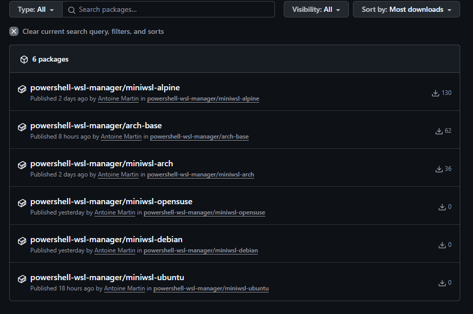

# Adding a new builtin distro

## How the build works

Each builtin distribution comes as a single layer Docker image published on the
github docker registry (ghcr.io). For each distribution, there are two versions:

- A configured version (see [here](../index.md#builtin-images))
- A non configured version that is named after the name of the configured
  version with the suffix `-base` (i.e. `alpine-base`).

All the builtin distributions are listed in a JSON file named
`builtins.rootfs.json` and pushed into the special github repository branch
`rootfs`. It is reachable from the internet at the following URL:

https://raw.githubusercontent.com/antoinemartin/PowerShell-Wsl-Manager/refs/heads/rootfs/builtins.rootfs.json

The docker container images as well as the above listing are produced by the
`.github/workflows/build-rootfs-oci.yaml` github actions workflow.

The process is composed of the following steps:

- Downloading the compressed base root filesystem from upstream.
- Extract distribution information from `/etc/os-release` or alternatively from
  `/usr/lib/os-release` inside the compressed filesystem.
- Create a Dockerfile containing the appropriate labels and the root filesystem
  as the sole layer.
- Build the Docker image and push it to the GitHub container registry.
- Extract the root filesystem and run the `configure.sh` script in it in a
  chroot jail.
- Re-compress the root filesystem.
- Update the Dockerfile to use the new root filesystem.
- Build the configured image and push it to the GitHub container registry.
- Generate the images JSON metadata information intended for
  `builtins.rootfs.json`.

The workflow works in matrix. It is triggered by a commit on the `deploy/images`
branch and is scheduled to run each Sunday morning at 2am.

When run, the workflow will build and push the new images automatically. After
that, all the metadata file are gathered into a `builtins.rootfs.json` file that
is pushed on the `rootfs` branch.

## Steps for adding a distribution

Adding a new named distro to the builtins involves the following steps:

- Download the distribution base root filesystem from upstream.
- Test it _as is_ with Wsl:
  ```ps1con
  PS> New-WslInstance test -From distro.tar.gz
  ```
- Adapt and/or test the `configure.sh` script for the new distribution:
  ```ps1con
  PS> Invoke-WslInstance -In test -User root ./configure.sh
  ```
- Add the distribution name and base root filesystem URL into the matrix
  configuration (see below).
- Test the build with a workflow dispatch, i.e. running the build manually.
- Test the images:
  ```ps1con
  PS> New-WslInstance test -From docker://ghcr.io/...#latest
  ```
- Make a pull request.

!!! warning "configure.sh line endings"

    The `configure.sh` script must use Unix line endings (LF) and not Windows
    line endings (CRLF). If you edit the file on Windows, ensure that your text
    editor is configured to use LF line endings.

The following details each step for [OpenSuse](https://www.opensuse.org/).
OpenSuse is a RPM based distribution close to RHEL. A rolling release version of
the distribution is available under the name
[Tumbleweed](https://www.opensuse.org/#Tumbleweed).

## Metadata description

The following example shows the metadata produced by the build workflow:

=== ":octicons-file-code-16: JSON"

    ```JSON
    {
      "Type": "Builtin",
      "Name": "opensuse-tumbleweed",
      "Os": "Opensuse-Tumbleweed",
      "Url": "docker://ghcr.io/antoinemartin/powershell-wsl-manager/opensuse-tumbleweed#latest",
      "Hash": {
        "Type": "docker"
      },
      "Digest": "0F970A413C0B90C8128688917DA900996BEDE810E7A240363283FA8D80AD8E69",
      "Release": "20251220",
      "Configured": true,
      "Username": "opensuse-tumbleweed",
      "Uid": 1000,
      "LocalFilename": "0F970A413C0B90C8128688917DA900996BEDE810E7A240363283FA8D80AD8E69.rootfs.tar.gz",
      "Size": 113146443,
      "Tags": [
        "latest"
      ]
    }
    ```

=== ":octicons-file-code-16: powershell"

    ```powershell
    @{
      Type          = "Builtin"
      Name          = "opensuse-tumbleweed"
      Os            = "Opensuse-Tumbleweed"
      Url           = "docker://ghcr.io/antoinemartin/powershell-wsl-manager/opensuse-tumbleweed#latest"
      Hash          = @{
        Type = "docker"
      }
      Digest        = "0F970A413C0B90C8128688917DA900996BEDE810E7A240363283FA8D80AD8E69"
      Release       = "20251220"
      Configured    = $true
      Username      = "opensuse-tumbleweed"
      Uid           = 1000
      LocalFilename = "0F970A413C0B90C8128688917DA900996BEDE810E7A240363283FA8D80AD8E69.rootfs.tar.gz"
      Size          = 113146443
      Tags          = @("latest")
    }
    ```

#### Hash Property Explanation

The `Hash` property in the metadata describes where to find the digest
information of the image in order to verify that the right content has been
downloaded. In the above example, it contains only:

```JSON
{
  "Type": "docker",
}
```

Because the digest is actually retrieved by accessing the manifest of the image.
More than that, it's part of the URL of the actual image payload, and it ensures
the integrity and authenticity of the downloaded image.

When the image is not a docker image and the URL has the following form:

> https://cdimages.ubuntu.com/ubuntu-wsl/daily-live/current/questing-wsl-amd64.wsl

The usual way to verify the image is to use a checksum file. The `Hash` property
in the metadata describes where to find the digest information of the image in
order to verify that the right content has been downloaded.

It has the following properties:

- **`Url`**: Points to the checksum file provided by the distro provider. This
  file contains the expected digest value for the Image archive.
- **`Type`**: `'sums'` indicates that the hash file contains checksum values for
  several files in a standard format, with the hash value followed by the
  filename:

  ```text
  8a8576ddf9d0fb6bad78acf970a0bf792d062f9125d029007823feaba7216bba rootfs.tar.xz
  4469fbcb82ad0b09a3a4b37d15bf1b708e8860fef4a9b43f50bdbd618fb217bf rootfs.squashfs
  ```

  `single` indicates that the destination contains only the hash value of the
  image, and with `docker` the hash is given by the manifest of the docker
  image.

- **`Algorithm`**: Specifies the hashing algorithm used to compute the digest.
  Nowadays, this is typically SHA256.

This verification process protects against corrupted downloads and ensures
you're installing the exact Image image that the distribution organization
intended to distribute.

## Performing the addition

For OpenSuse, the upstream image URL we find is the following:

```text
https://download.opensuse.org/tumbleweed/appliances/opensuse-tumbleweed-dnf-image.x86_64-lxc-dnf.tar.xz
```

### Create an instance from the Upstream URL

Create a local WSL instance with the URL:

```ps1con
PS> New-WslInstance suse -From https://download.opensuse.org/tumbleweed/appliances/opensuse-tumbleweed-dnf-image.x86_64-lxc-dnf.tar.xz
⌛ Creating directory [C:\Users\AntoineMartin\AppData\Local\Wsl\suse]...
⌛ Downloading https://download.opensuse.org/tumbleweed/appliances/opensuse-tumbleweed-dnf-image.x86_64-lxc-dnf.tar.xz...
opensuse-tumbleweed-dnf-image.x86_64-lxc-dnf.tar.xz (46,4 MB) [============================================================================================================================================================] 100%
🎉 [Opensuse:tumbleweed] Synced at [C:\Users\AntoineMartin\AppData\Local\Wsl\RootFS\1040342FFDB679BA1FDA75A81611DFCBA61129E1048901FE62F0C3271873E007.rootfs.tar.gz].
⌛ Creating instance [suse] from [C:\Users\AntoineMartin\AppData\Local\Wsl\RootFS\1040342FFDB679BA1FDA75A81611DFCBA61129E1048901FE62F0C3271873E007.rootfs.tar.gz]...
🎉 Done. Command to enter instance: Invoke-WslInstance -In suse or wsl -d suse

Name                                        State Version Default
----                                        ----- ------- -------
suse                                      Stopped       2   False

PS>
```

### Adapt and test the configure script

The `configure.sh` script configures the system. It identifies the Linux flavor
by looking at the `ID` variable in the `/etc/os-release` script:

```bash
PS> wsl -d suse cat /etc/os-release
NAME="openSUSE Tumbleweed"
# VERSION="20221215"
ID="opensuse-tumbleweed"
...
PS>
```

Here it will use `opensuse` as the os name as well as the name for the default
user to create.

The script tries to call a `configure_suse()` function. Let's create one in the
script:

```bash

configure_opensuse() {
  echo "Hello from Tumbleweed..."
}
```

!!! note

    As the script may be run through bash in posix mode (debian), dash or
    ash (alpine), you should stick to good old Bourne Again Shell syntax (POSIX) as
    much as possible.

We can now invoke the script:

=== "With Wsl Manager"

    ```ps1con
    PS> Invoke-WslConfigure suse -Verbose
    COMMENTAIRES : Piping wsl.exe with arguments: --list --verbose
    COMMENTAIRES : Opération « Configure instance » en cours sur la cible « suse ».
    ⌛ Running initialization script [C:\Users\AntoineMartin\Documents\WindowsPowerShell\Modules\Wsl-Manager/configure.sh] on instance [suse]...
    COMMENTAIRES : Running wsl.exe with arguments: -d suse -u root ./configure.sh
    COMMENTAIRES : Output:
    We are on opensuse
    Hello from Tumbleweed...
    Configuration done.
    <end of output>
    🎉 Configuration of instance [suse] completed successfully.

    Name                                        State Version Default
    ----                                        ----- ------- -------
    suse                                      Stopped       2   False

    PS>
    ```

=== "With the wsl command"

    ```ps1con
    PS> cd $env:USERPROFILE\Documents\WindowsPowerShell\Modules\Wsl-Manager
    PS> wsl -d suse -u root ./configure.sh
    We are on opensuse
    Hello from Tumbleweed...
    Configuration done.
    PS>
    ```

When the configuration has been performed without errors, the `configure.sh`
script creates a file named `/etc/wsl-configured` to prevent re-configuration in
case the WSL distribution is
[exported](../usage/reference/export-wsl-instance.md).

Running the configuration again doesn't work:

```bash
PS> wsl -d suse -u root ./configure.sh
Already configured
PS>
```

However, deleting the file `/etc/wsl-configured` allows re-running the
configuration again:

```bash
PS> wsl -d suse -u root rm /etc/wsl-configured
PS> Invoke-WslConfigure suse
We are on opensuse
Hello from Tumbleweed...
Configuration done.
PS>
```

You have the same behavior using the `Invoke-WslConfigure` cmdlet with the
`-Force` Parameter:

```ps1con
PS>  Invoke-WslConfigure suse -Force -Verbose
COMMENTAIRES : Piping wsl.exe with arguments: --list --verbose
COMMENTAIRES : Opération « Configure instance » en cours sur la cible « suse ».
COMMENTAIRES : Force reconfiguration of instance [suse]
COMMENTAIRES : Running wsl.exe with arguments: -d suse -u root rm -rf /etc/wsl-configured
⌛ Running initialization script [C:\Users\AntoineMartin\Documents\WindowsPowerShell\Modules\Wsl-Manager/configure.sh] on instance [suse]...
COMMENTAIRES : Running wsl.exe with arguments: -d suse -u root ./configure.sh
COMMENTAIRES : Output:
We are on opensuse
Hello from Tumbleweed...
Configuration done.
<end of output>
🎉 Configuration of instance [suse] completed successfully.

Name                                        State Version Default
----                                        ----- ------- -------
suse                                      Stopped       2   False


```

Now this is a matter of completing the `configure_opensuse()` method in order to
perform the configuration.

OpenSuse is a RPM based distribution similar to RHEL. The configuration script
already contains a function `configure_rhel_like()` to configure such systems.
The main difference between Suse and the RHEL based distributions is the use of
`dnf` as the package manager. `dnf` is a fork of `yum` and is command line
compatible. Instead of copy/pasting `configure_rhel_like()` to create
`configure_opensuse()`, we can adapt `configure_rhel_like()` to take the name of
the package manager as argument.:

```diff
diff --git a/configure.sh b/configure.sh
index f622a5d..87d3c2e 100644
--- a/configure.sh
+++ b/configure.sh
@@ -269,7 +269,8 @@ configure_arch() {

 # Configure a RHEL like system (CentOS, Almalinux, ...)
 #
-# @param $1 list of groups separated by commas of the groups to add to the sudo
+# @param $1 the name of the package manager (yum, dnf)
+# @param $2 list of groups separated by commas of the groups to add to the sudo
 #           user. The administrative groups may differ from distribution to
 #           distribution (staff, wheel, admin).
 # @param $@ list of additionnal packages to add.
@@ -283,14 +284,16 @@ configure_arch() {
 # - Add a sudo user derived from the name of the distribution with the
 #   appropriate configuration and groups
 configure_rhel_like() {
+    local pkmgr=$1
+    shift
     local admin_group_name=$1
     shift
     local additional_packages="$@"

     echo "Adding packages..."
-    yum -y -q makecache >/dev/null 2>&1
-    yum -y -q install zsh git sudo gnupg socat openssh-clients tar $additional_packages >/dev/null 2>&1
-    yum -y clean all >/dev/null 2>&1
+    $pkmgr -y -q makecache >/dev/null 2>&1
+    $pkmgr -y -q install zsh git sudo gnupg socat openssh-clients tar $additional_packages >/dev/null 2>&1
+    $pkmgr -y clean all >/dev/null 2>&1

     change_root_shell
```

Then we need to adapt the already existing `configure_...()` functions in order
to pass `yum` as argument:

```diff
@@ -304,22 +307,31 @@ configure_rhel_like() {
 # Configure an Alma Linux System
 # @ see configure_rhel_like
 configure_almalinux() {
-    configure_rhel_like adm,wheel
+    configure_rhel_like yum adm,wheel
 }

 # Configure a Rocky Linux System
 # @ see configure_rhel_like
 configure_rocky() {
-    configure_rhel_like adm,wheel
+    configure_rhel_like yum adm,wheel
 }

 # Configure a CentOS Linux System
 # @ see configure_rhel_like
 configure_centos() {
-    configure_rhel_like adm,wheel
+    configure_rhel_like yum adm,wheel
 }
```

And then through trial and error, we find the following peculiarities to Suse:

- The _admin_ group seems to be `trusted`
- The `curl` and `gzip` commands are not present on the base system and need to
  be installed.
- `dnf` is slow but
  [can be made faster](https://ostechnix.com/how-to-speed-up-dnf-package-manager-in-fedora/).

We end up with the following `configure_opensuse()` command:

```diff
+# Configure an OpenSuse Linux System
+# @ see configure_rhel_like
+configure_opensuse() {
+    echo "max_parallel_downloads=10" >> /etc/dnf/dnf.conf
+    echo "fastestmirror=True" >> /etc/dnf/dnf.conf
+
+    configure_rhel_like dnf trusted curl gzip
+}
+
 username=$(cat /etc/os-release | grep ^ID= | cut -d= -f 2 | tr -d '"' | cut -d"-" -f 1)
 if [ -z "$username" ]; then
     echo "Can't find distribution flavor"
```

!!! warning "Important"

     When a error occurs on gitstatus initialization, executing the following is
     useful for debugging:

     ```bash
     PS> wsl -d suse -u root sh -c "echo GITSTATUS_LOG_LEVEL=DEBUG >> ~/.zshrc"
     ```

Once the modifications are performed, the full test cycle is the following:

```ps1con
PS> Remove-WslInstance suse
PS> New-WslInstance suse -From https://download.opensuse.org/tumbleweed/appliances/opensuse-tumbleweed-dnf-image.x86_64-lxc-dnf.tar.xz
...
PS> Invoke-WslConfigure suse -Verbose
COMMENTAIRES : Piping wsl.exe with arguments: --list --verbose
COMMENTAIRES : Opération « Configure instance » en cours sur la cible « suse ».
⌛ Running initialization script [C:\Users\AntoineMartin\Documents\WindowsPowerShell\Modules\Wsl-Manager/configure.sh] on instance [suse]...
COMMENTAIRES : Running wsl.exe with arguments: -d suse -u root ./configure.sh
COMMENTAIRES : Output:
We are on opensuse
Adding packages...
Change root shell to zsh
Adding oh-my-zsh...
Configuring root home directory /root...
Configuring user opensuse...
Configuring opensuse home directory /home/opensuse...
Configuration done.
<end of output>
🎉 Configuration of instance [suse] completed successfully.

Name                                        State Version Default
----                                        ----- ------- -------
suse                                      Stopped       2   False

PS> wsl -d suse -u opensuse
[powerlevel10k] fetching gitstatusd .. [ok]
❯ id
uid=1000(opensuse) gid=1000(opensuse) groups=1000(opensuse),42(trusted)
❯ exit
PS>
```

### Adding the flavor to the matrix

The `.github/templates/builtins_matrix.json.tpl` file contains the image URLs
for each builtin distribution. Add an entry with the name `opensuse` and the
above URL:

```json title=".github/templates/builtins_matrix.json.tpl"
{
  "include": [
    ...
    {
        "flavor": "opensuse",
        "version": "latest",
        "url": "https://download.opensuse.org/tumbleweed/appliances/opensuse-tumbleweed-dnf-image.x86_64-lxc-dnf.tar.xz"
    }
  ]
}
```

You also need to add the `opensuse` flavor has one of the possible values of the
workflow dispatch:

```yaml title=".github/workflows/build-rootfs-oci.yaml" linenums="18" hl_lines="9 14"
on:
  workflow_dispatch:
    inputs:
      flavor:
        description: "Root FS flavor"
        required: true
        default: "arch"
        type: choice
        options:
          - ubuntu
          - arch
          - alpine
          - debian
          - opensuse
```

You can now trigger the workflow manually from your fork of the repository:


Once built, the image should appear in the project's packages.



### Testing the installation of the image

Once the docker image is built and available in the github registry, you can
test it with Wsl-Manager:

We can test built image with Wsl-Manager:

```ps1con
PS> New-WslInstance suse -From docker://ghcr.io/yourorganisation/powershell-wsl-manager/opensuse#latest | iwsl
...
[powerlevel10k] fetching gitstatusd .. [ok]
  /mnt/c/Users/AntoineMartin                                                                                07:36:00
❯
```

You can now commit your modifications and make a pull request :+1: :smile:.
