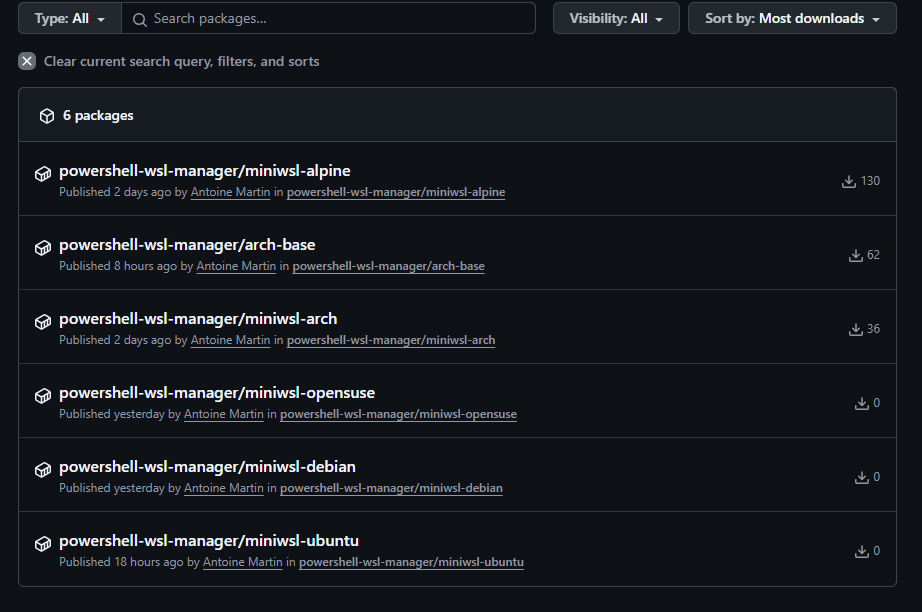

<!-- markdownlint-disable MD033 -->
<details open markdown="block">
  <summary>Table of contents</summary>{: .text-delta }
- TOC
{:toc}
</details>
<!-- markdownlint-enable MD033 -->

## Adding a new named distro

Adding a named distro involves the following steps:

- Adding the URL of the root filesystem to the `Distributions.psd1` data file.
- Testing the installation of the root filesystem without configuration.
- Adapt and/or test the `configure.sh` script for the new distribution.
- Test the installation with local configuration.
- Add the distribution to the `.github\workflows\build-rootfs-oci.yaml` github
  actions workflow file.
- Build the already configured root filesystem through Github Actions and
  publish it. This is done by moving the tip of the `deploy/images` branch to a
  commit including the new version.
- Add the URL of the configured root filesystem to the `Distributions.psd1` file
  with the `Configured` suffix in the name.
- Test the installation of the already configured root filesystem.

The following details each step for [OpenSuse](https://www.opensuse.org/).
OpenSuse is a RPM based distribution close to RHEL. A rolling release version of
the distribution is available under the name
[Tumbleweed](https://www.opensuse.org/#Tumbleweed).

### Adding the URL

The rootfs URL we find is the following:

```text
https://download.opensuse.org/tumbleweed/appliances/opensuse-tumbleweed-dnf-image.x86_64-lxc-dnf.tar.xz
```

The `Distributions.psd1` file contains the root filesystem URLs for each builtin
distribution. Add an entry with the name `OpenSuse` and the above URL:

```powershell
@{
    ...
    OpenSuse = @{
        Name    = 'OpenSuse'
        Url     = "https://download.opensuse.org/tumbleweed/appliances/opensuse-tumbleweed-dnf-image.x86_64-lxc-dnf.tar.xz"
        Hash    = @{
            Url       = 'https://download.opensuse.org/tumbleweed/appliances/opensuse-tumbleweed-dnf-image.x86_64-lxc-dnf.tar.xz.sha256'
            Algorithm = 'SHA256'
            Type      = 'sums'
        }
        Release = 'tumbleweed'
        Configured = $false
    }
}
```

#### Hash Property Explanation

The `Hash` property ensures the integrity and authenticity of the downloaded
root filesystem:

- **`Url`**: Points to the SHA256 checksum file provided by OpenSUSE. This file
  contains the expected hash value for the rootfs archive.
- **`Algorithm`**: Specifies the hashing algorithm used (SHA256 in this case),
  which provides strong cryptographic verification.
- **`Type`**: Set to `'sums'` indicating the hash file contains checksum values
  in a standard format, typically with the hash value followed by the filename.
  The other possible values are `single` when the destination contains only the
  hash value, or `docker` when the hash is given by the manifest of the docker
  image.

This verification process protects against corrupted downloads and ensures
you're installing the exact rootfs image that OpenSUSE intended to distribute.

### Testing the installation of the root filesystem

We can test the installation of the root filesystem with the following:

```bash
PS> Remove-Module Wsl-Manager
PS> install-wsl suse -Distribution OpenSuse -SkipConfigure
⌛ Creating directory [C:\Users\AntoineMartin\AppData\Local\Wsl\suse]...
⌛ Getting checksums from https://download.opensuse.org/tumbleweed/appliances/opensuse-tumbleweed-dnf-image.x86_64-lxc-dnf.tar.xz.sha256...
Downloading https://download.opensuse.org/tumbleweed/appliances/opensuse-tumbleweed-dnf-image.x86_64-lxc-dnf.tar.xz to C:\Users\AntoineMartin\AppData\Local\Wsl\RootFS\opensuse.rootfs.tar.gz with filename opensuse-tumbleweed-dnf-image.x86_64-lxc-dnf.tar.xz
⌛ Downloading https://download.opensuse.org/tumbleweed/appliances/opensuse-tumbleweed-dnf-image.x86_64-lxc-dnf.tar.xz...
opensuse-tumbleweed-dnf-image.x86_64-lxc-dnf.tar.xz (46,3 MB) [===========================================================================================================================================] 100%
🎉 [Opensuse:tumbleweed] Synced at [C:\Users\AntoineMartin\AppData\Local\Wsl\RootFS\opensuse.rootfs.tar.gz].
⌛ Creating distribution [suse] from [C:\Users\AntoineMartin\AppData\Local\Wsl\RootFS\opensuse.rootfs.tar.gz]...
🎉 Done. Command to enter distribution: wsl -d suse
PS> wsl -d suse
# id
uid=0(root) gid=0(root) groups=0(root)
# exit
logout
PS>
```

### Adapt and test the configure script

The `configure.sh` script configures the system. It identifies the Linux flavor
by looking at the `ID` variable in the `/etc/os-release` script:

```bash
PS> wsl -d suse cat /etc/os-release
NAME="openSUSE Tumbleweed"
# VERSION="20221215"
ID="opensuse-tumbleweed"
...
PS>
```

Here it will use `opensuse` as the os name as well as the name for the default
user to create.

The script tries to call a `configure_suse()` function. Let's create one in the
script:

```bash

configure_opensuse() {
  echo "Hello from Tumbleweed..."
}
```

{: .highlight }

As the script may be run through bash in posix mode (debian), dash or ash
(alpine), you should stick to good old Bourne Again Shell syntax (POSIX) as much
as possible.

We can now invoke the script:

```bash
PS> cd $env:USERPROFILE\Documents\WindowsPowerShell\Modules\Wsl-Manager
PS> wsl -d suse -u root ./configure.sh
We are on opensuse
Hello from Tumbleweed...
Configuration done.
PS>
```

When the configuration has been performed without errors, the `configure.sh`
script creates a file named `/etc/wsl-configured` to prevent re-configuration in
case the WSL distribution is [exported](./usage/command-reference#export-wsl).

Running the configuration again doesn't work:

```bash
PS> wsl -d suse -u root ./configure.sh
Already configured
PS>
```

However, deleting the file `/etc/wsl-configured` allows re-running the
configuration again:

```bash
PS> wsl -d suse -u root rm /etc/wsl-configured
PS> wsl -d suse -u root ./configure.sh
We are on opensuse
Hello from Tumbleweed...
Configuration done.
PS>
```

Now this is a matter of completing the `configure_opensuse()` method in order to
perform the configuration.

OpenSuse is a RPM based distribution similar to RHEL. The configuration script
already contains a function `configure_rhel_like()` to configure such systems.
The main difference between Suse and the RHEL based distributions is the use of
`dnf` as the package manager. `dnf` is a fork of `yum` and is command line
compatible. Instead of copy/pasting `configure_rhel_like()` to create
`configure_opensuse()`, we can adapt `configure_rhel_like()` to take the name of
the package manager as argument.:

```diff
diff --git a/configure.sh b/configure.sh
index f622a5d..87d3c2e 100644
--- a/configure.sh
+++ b/configure.sh
@@ -269,7 +269,8 @@ configure_arch() {

 # Configure a RHEL like system (CentOS, Almalinux, ...)
 #
-# @param $1 list of groups separated by commas of the groups to add to the sudo
+# @param $1 the name of the package manager (yum, dnf)
+# @param $2 list of groups separated by commas of the groups to add to the sudo
 #           user. The administrative groups may differ from distribution to
 #           distribution (staff, wheel, admin).
 # @param $@ list of additionnal packages to add.
@@ -283,14 +284,16 @@ configure_arch() {
 # - Add a sudo user derived from the name of the distribution with the
 #   appropriate configuration and groups
 configure_rhel_like() {
+    local pkmgr=$1
+    shift
     local admin_group_name=$1
     shift
     local additional_packages="$@"

     echo "Adding packages..."
-    yum -y -q makecache >/dev/null 2>&1
-    yum -y -q install zsh git sudo gnupg socat openssh-clients tar $additional_packages >/dev/null 2>&1
-    yum -y clean all >/dev/null 2>&1
+    $pkmgr -y -q makecache >/dev/null 2>&1
+    $pkmgr -y -q install zsh git sudo gnupg socat openssh-clients tar $additional_packages >/dev/null 2>&1
+    $pkmgr -y clean all >/dev/null 2>&1

     change_root_shell
```

Then we need to adapt the already existing `configure_...()` functions in order
to pass `yum` as argument:

```diff
@@ -304,22 +307,31 @@ configure_rhel_like() {
 # Configure an Alma Linux System
 # @ see configure_rhel_like
 configure_almalinux() {
-    configure_rhel_like adm,wheel
+    configure_rhel_like yum adm,wheel
 }

 # Configure a Rocky Linux System
 # @ see configure_rhel_like
 configure_rocky() {
-    configure_rhel_like adm,wheel
+    configure_rhel_like yum adm,wheel
 }

 # Configure a CentOS Linux System
 # @ see configure_rhel_like
 configure_centos() {
-    configure_rhel_like adm,wheel
+    configure_rhel_like yum adm,wheel
 }
```

And then through trial and error, we find the following peculiarities to Suse:

- The _admin_ group seems to be `trusted`
- The `curl` and `gzip` commands are not present on the base system and need to
  be installed.
- `dnf` is slow must
  [can be made faster](https://ostechnix.com/how-to-speed-up-dnf-package-manager-in-fedora/).

We end up with the following `configure_opensuse()` command:

```diff
+# Configure an OpenSuse Linux System
+# @ see configure_rhel_like
+configure_opensuse() {
+    echo "max_parallel_downloads=10" >> /etc/dnf/dnf.conf
+    echo "fastestmirror=True" >> /etc/dnf/dnf.conf
+
+    configure_rhel_like dnf trusted curl gzip
+}
+
 username=$(cat /etc/os-release | grep ^ID= | cut -d= -f 2 | tr -d '"' | cut -d"-" -f 1)
 if [ -z "$username" ]; then
     echo "Can't find distribution flavor"
```

{: .important }

> When a error occurs on gitstatus initialization, executing the following is
> useful for debugging:
>
> ```bash
> PS> wsl -d suse -u root sh -c "echo GITSTATUS_LOG_LEVEL=DEBUG >> ~/.zshrc"
> ```

The full test cycle is the following:

```bash
PS> Uninstall-Wsl suse
PS> Install-Wsl suse -Distribution OpenSuse -SkipConfigure
...
PS> wsl -d suse -u root ./configure.sh
We are on opensuse
Adding packages...
Change root shell to zsh
Adding oh-my-zsh...
Configuring root home directory /root...
Configuring user opensuse...
Group 'mail' not found. Creating the user mailbox file with 0600 mode.
Configuring opensuse home directory /home/opensuse...
Configuration done.
PS> wsl -d suse -u opensuse
[powerlevel10k] fetching gitstatusd .. [ok]
❯ id
uid=1000(opensuse) gid=1000(opensuse) groups=1000(opensuse),42(trusted)
❯ exit
PS>
```

And then finally the same without `-SkipConfigure`:

```bash
PS> Uninstall-Wsl suse
PS> Install-Wsl suse -Distribution OpenSuse
⌛ Creating directory [C:\Users\AntoineMartin\AppData\Local\Wsl\suse]...
👀 [Opensuse:tumbleweed] Root FS already at [C:\Users\AntoineMartin\AppData\Local\Wsl\RootFS\opensuse.rootfs.tar.gz].
⌛ Creating distribution [suse] from [C:\Users\AntoineMartin\AppData\Local\Wsl\RootFS\opensuse.rootfs.tar.gz]...
⌛ Running initialization script [configure.sh] on distribution [suse]...
🎉 Done. Command to enter distribution: wsl -d suse
PS> wsl -d suse
[powerlevel10k] fetching gitstatusd .. [ok]
❯ id
uid=1000(opensuse) gid=1000(opensuse) groups=1000(opensuse),42(trusted)
❯ exit
PS>
```

### Add the building of the distribution to github actions

You need to add the new flavor to the matrix strategy in
`.github/workflows/build-rootfs-oci.yaml`:

```diff
diff --git a/.github/workflows/build-rootfs-oci.yaml b/.github/workflows/build-rootfs-oci.yaml
index a1b2c3d..e4f5g6h 100644
--- a/.github/workflows/build-rootfs-oci.yaml
+++ b/.github/workflows/build-rootfs-oci.yaml
@@ -27,6 +27,7 @@ on:
           - arch
           - alpine
           - debian
+          - opensuse
       version:
         description: 'Version tag for the image. For other than Arch and Alpine, it should be latest'
         required: true
@@ -61,7 +62,7 @@ jobs:
             echo "matrix={\"include\":[{\"flavor\":\"${{ inputs.flavor }}\",\"version\":\"${{ inputs.version }}\"}]}" >> $GITHUB_OUTPUT
           else
             echo "Using matrix for deploy/images branch or scheduled build"
-            echo "matrix={\"include\":[{\"flavor\":\"arch\",\"version\":\"${{ env.ARCH_DEFAULT_VERSION }}\"},{\"flavor\":\"alpine\",\"version\":\"${{ env.ALPINE_DEFAULT_VERSION }}\"},{\"flavor\":\"ubuntu\",\"version\":\"latest\"},{\"flavor\":\"debian\",\"version\":\"latest\"}]}" >> $GITHUB_OUTPUT
+            echo "matrix={\"include\":[{\"flavor\":\"arch\",\"version\":\"${{ env.ARCH_DEFAULT_VERSION }}\"},{\"flavor\":\"alpine\",\"version\":\"${{ env.ALPINE_DEFAULT_VERSION }}\"},{\"flavor\":\"ubuntu\",\"version\":\"latest\"},{\"flavor\":\"debian\",\"version\":\"latest\"},{\"flavor\":\"opensuse\",\"version\":\"latest\"}]}" >> $GITHUB_OUTPUT
           fi
           echo "Final values:"
           echo "Matrix: $(cat $GITHUB_OUTPUT | grep matrix= | cut -d= -f2)"
@@ -215,6 +216,9 @@ jobs:
             debian)
               echo "base_url=https://doi-janky.infosiftr.net/job/tianon/job/debuerreotype/job/amd64/lastSuccessfulBuild/artifact/stable/rootfs.tar.xz" >> $GITHUB_OUTPUT
               ;;
+            opensuse)
+              echo "base_url=https://download.opensuse.org/tumbleweed/appliances/opensuse-tumbleweed-dnf-image.x86_64-lxc-dnf.tar.xz" >> $GITHUB_OUTPUT
+              ;;
             *)
               echo "Unsupported flavor: ${FLAVOR}"
               exit 1
```

The URL is the URL that has been added to `Distributions.psd1` previously.

At this point, the code modifications can be pushed to a branch in your github
fork.

### Test the Github actions building of the configured distribution

The generation of the configured images needs to be triggered manually your fork
interface. Please refer to
[Building Custom Root FS as OCI Images](../build-oci-images#triggering-the-workflow)
page.

Once built, the image should appear in the project's packages.



### Add the URL of configured filesystem to the module

You can add the URL of the generated distribution in the `Distributions.psd1`
source file:

```diff
diff --git a/Distributions.psd1 b/Distributions.psd1
index a1b2c3d..e4f5g6h 100644
--- a/Distributions.psd1
+++ b/Distributions.psd1
@@ -54,6 +54,17 @@
         Release = 'bookworm'
         Configured = $false
     }
+    OpenSuse = @{
+        Name    = 'OpenSuse'
+        Url     = "https://download.opensuse.org/tumbleweed/appliances/opensuse-tumbleweed-dnf-image.x86_64-lxc-dnf.tar.xz"
+        Hash    = @{
+            Url       = 'https://download.opensuse.org/tumbleweed/appliances/opensuse-tumbleweed-dnf-image.x86_64-lxc-dnf.tar.xz.sha256'
+            Algorithm = 'SHA256'
+            Type      = 'sums'
+        }
+        Release = 'tumbleweed'
+        Configured = $false
+    }

     # Configured distributions (pre-configured/miniwsl)
     ArchConfigured     = @{
@@ -92,4 +103,13 @@
         Release = 'bookworm'
         Configured = $true
     }
+    OpenSuseConfigured = @{
+        Name    = 'OpenSuse'
+        Url     = "docker://ghcr.io/antoinemartin/powershell-wsl-manager/miniwsl-opensuse#latest"
+        Hash    = @{
+            Type      = 'docker'
+        }
+        Release = 'tumbleweed'
+        Configured = $true
+    }
 }
```

### Test the installation of the already configured filesystem

You can now test the newly created distribution:

```bash
PS> Remove-Module wsl-manager
PS> Uninstall-Wsl suse
PS> Install-Wsl suse -Distribution OpenSuse -Configured
⌛ Downloading Docker image layer from ghcr.io/antoinemartin/powershell-wsl-manager/miniwsl-opensuse:latest...
⌛ Getting docker authentication token for registry ghcr.io and repository antoinemartin/powershell-wsl-manager/miniwsl-opensuse...
⌛ Getting image manifests from https://ghcr.io/v2/antoinemartin/powershell-wsl-manager/miniwsl-opensuse/manifests/latest...
⌛ Getting image manifest from https://ghcr.io/v2/antoinemartin/powershell-wsl-manager/miniwsl-opensuse/manifests/sha256:39d02eebc2df0ec65181ba648f4b8be821a82306d2f95c021fdf3a65497ce5d2...
⌛ Getting image configuration manifest from https://ghcr.io/v2/antoinemartin/powershell-wsl-manager/miniwsl-opensuse/blobs/sha256:70b87acf3ebcd2618d5ae2385a8d524632199b8e58fc8eb6966be68a1c7d3242...
👀 Root filesystem size: 107,2 MB. Digest sha256:eedf8320628284ed2ebc7e70331c9010e5349f10c1c36eaf25d9b06659897d4b. Downloading...
sha256:eedf8320628284ed2ebc7e70331c9010e5349f10c1c36eaf25d9b06659897d4b (107,2 MB) [======================================================================================================================] 100%
🎉 Successfully downloaded Docker image layer to C:\Users\AntoineMartin\AppData\Local\Wsl\RootFS\miniwsl.opensuse.rootfs.tar.gz.tmp
👀 Downloaded file size: 107,2 MB
🎉 [Opensuse:tumbleweed] Synced at [C:\Users\AntoineMartin\AppData\Local\Wsl\RootFS\miniwsl.opensuse.rootfs.tar.gz].
⌛ Creating distribution [suse] from [C:\Users\AntoineMartin\AppData\Local\Wsl\RootFS\miniwsl.opensuse.rootfs.tar.gz]...
🎉 Done. Command to enter distribution: wsl -d susePS> wsl -d suse
[powerlevel10k] fetching gitstatusd .. [ok]
❯ id
uid=1000(opensuse) gid=1000(opensuse) groups=1000(opensuse),42(trusted)
❯ exit
PS>
```

You can now commit your modifications and make a pull request :+1: :smile:.
