<!-- cSpell: ignore sshcontrol socat subkeys subkey fontawesome stackoverflow Kleopatra -->

# Centralized Signature and Key Management

This page provides an overview of how to implement centralized signature and key
management for your WSL instances.

The Wsl Manager configured instances deploy a [zsh plugin] that creates a bridge
between the WSL instances and the Windows host, allowing for seamless key and
signature management.

The setup and initial management is a bit tedious because it involves multiple
steps and configurations. However we believe that the benefits of centralized
key management and seamless integration between WSL and Windows are worth the
effort. There are benefits in security, usability, and maintainability.

## Overview

We use [gpg4win] for managing GPG keys and signatures on Windows. This allows
for a seamless integration between WSL and Windows, enabling the use of the same
GPG keys and configurations across environments.

- GnuPG is configured to serve as a backend for SSH authentication, allowing for
  the use of GPG keys for SSH connections.
- SSH keys are added to the GPG agent.

The zsh plugin performs the following:

1. If the `wsl2-ssh-pageant.exe` executable is not present, download it to
   `C:\Users\Public\Downloads`
2. Set and export the `SSH_AUTH_SOCK` variable to `$HOME/.ssh/agent.sock`
3. Set and export the `GPG_AGENT_SOCK` variable to `$HOME/.gnupg/S.gpg-agent`
4. Launch the [socat] command listening on the respective socket. When a
   connection is made, it will fork `wsl2-ssh-pageant.exe` that will run on
   Windows. `wsl2-ssh-pageant.exe` will open a connection to the appropriate
   Windows named pipe (either `S.gpg-agent` or `S.gpg-agent.ssh`) and redirect
   the input and output. This will allow the Wsl instance `gnupg` and `ssh`
   programs to use the Windows agents as if they were running natively.

The following diagram shows the architecture of the solution:

```mermaid
graph TD;
  subgraph Linux ["🐧 Linux (WSL)"]
    A[SSH Client]
    B[GPG Client]
    C[socat SSH]
    D[socat GPG]
  end

  subgraph Windows ["🪟 Windows Host"]
    G[wsl2-ssh-pageant]
    H[wsl2-ssh-pageant]
    E[SSH Agent]
    F[GPG Agent]
  end

  A <-->|<small><tt>$HOME/.ssh/agent.sock</tt></small>| C
  B <-->|<small><tt>$HOME/.gnupg/S.gpg-agent</tt></small>| D
  C <-->|<small>WSL I/O</small>| G
  D <-->|<small>WSL I/O</small>| H
  G <--> |<small><tt>$Env:LOCALAPPDATA\gnupg\S.gpg-agent</tt></small>| E
  H <--> |<small><tt>$Env:LOCALAPPDATA\gnupg\S.gpg-agent.ssh</tt></small>| F
```



## Windows configuration

### GPG4Win Installation

First install [gpg4win]. If you are using scoop (recommended), issue the
following command in a powershell terminal:

```ps1con
scoop install gpg4win
```

Launch the installed client GUI, Kleopatra, in order to verify the installation.

### GPG Agent configuration

Please refer to the [gnupg documentation]. The configuration files are located
in the `$Env:APPDATA\gnupg` directory.

The following are the relevant options for our use case:

=== ":octicons-file-code-16: gpg-agent.conf"

    ```unixconfig
    # Keys are cached (no password requested) for 4 hours
    default-cache-ttl 14400
    default-cache-ttl-ssh 14400
    # Even if refreshed, a key may not last in the cache for more than 8 hours
    max-cache-ttl 28800
    max-cache-ttl-ssh 28800

    # Enable the SSH support
    enable-ssh-support
    # Enable putty pageant support
    enable-putty-support
    # Enable the Win32 OpenSSH support
    enable-win32-openssh-support
    ```

=== ":octicons-file-code-16: gpg.conf"

    ```unixconfig
    # UTF-8 support for compatibility
    charset utf-8
    # Enable smartcard (to use Yubikey for instance)
    use-agent
    ```

### Restart the GPG agent

To restart the GPG agent, you can use the following command:

```ps1con
# kill the agent
gpgconf --kill gpg-agent
# restart the agent
gpg-connect-agent /bye
```

## Key Management

### Create a new key pair (if needed)

If you don't already have a GPG key pair, you can create one using one of the
following scripts. Each of them creates a GPG key pair with 3 subkeys:

- One for Authentication (SSH)
- One for Signature (Git)
- One for Encryption (Files, SOPS...)

The created keys are RSA 4096 keys that can be deployed on a yubikey by
following the [yubikey initialization] documentation.

=== ":fontawesome-brands-windows: Windows"

    The following `New-GPGKeys.ps1`[:octicons-download-16:](New-GPGKeys.ps1 "Download"){:download="New-GPGKeys.ps1"} creates
    the key pair and its subkeys on Windows.

    /// collapse-code
    ```powershell
    --8<-- "docs/examples/New-GPGKeys.ps1"
    ```
    ///

    You invoke it with:

    ```ps1con
    .\New-GPGKeys.ps1 -Name "Antoine Martin" -Email "antoine@mrtn.fr"
    ```

=== ":fontawesome-brands-linux: Linux"

    The following `create_keys.sh`[:octicons-download-16:](create_keys.sh "Download"){:download="create_keys.sh"} creates
    the key pair and its subkeys on Linux. You invoke it with:

    /// collapse-code
    ```bash
    --8<-- "docs/examples/create_keys.sh"
    ```
    ///

    ```bash
    ./create_keys.sh -n "Antoine Martin" -e "antoine@mrtn.fr"
    ```

!!! tip "Multiple password queries"

    You will be asked four (4) times for a password. The first one, it's for
    creating the main key pair. The 3 following requests are for signing the
    subkeys with the main key. In consequence you need to **always enter the
    same password**.

### Add keys to SSH agent

There are two ways for the keys to be recognized by the SSH agent:

- Their key grip is added to the SSH control file,
  `$Env:APPDATA\gnupg\sshcontrol`. This method is now
  [deprecated][gpg-agent documentation].
- They have the attribute `Use-for-ssh` set to `true`.

#### Adding a GPG key subkey

To add the authentication subkey of an existing key, you can use the following
command:

```ps1con
PS> gpg -K --with-keygrip --with-colon <key id> |`
  % -Begin { $s=$false } {$a = ($_ -split ':'); if ($a[11] -eq 'a') { $s=$true } else { if ($s -and $a[0] -eq 'grp') { $s=$false; $a[9] }}} |`
  % { gpg-connect-agent "keyattr $_ Use-for-ssh: true" /bye }
OK
PS>
```

Once this is done, the public part of the key should appear in the output of
`ssh-add -L` both on Windows and inside the Wsl instances:

```ps1con hl_lines="3"
PS> ssh-add -L
ssh-rsa AAAAB3NzaC1yc2EAAAADAQABAAACAQDeiN0u+kazFEkAYr2BTPT2I2q9dPyioPpaYVLfO+W5gzjX1W+Ad856w0YYNunAfDCc7cIJE553rC72xX/7W136Bz7bZPqE5f3YQnYqAFkuO2jR3buLxzHaBctE8pAGxkCkO9nyT9w3CRZ3KC2rSoc5i+RxftCraAyJ2HKHlnKoLkJN9pW3yzZv0suOniTGEZWlqZU/B9Z6DS0z1Ym+HNUr4L5p7t7uAp1HDgz5KK/aD+yJ7S1epitICZWg2+exOp1XrtM6+eabQFatkpwVJO7GtsJZYTjX71txx0jc6ysNdptj4ifHhenISdD/8vPQhkVoMeBlj3UgakBKAjBHZcrDmnhpjDIW/rAd/FdQOKIpvaJo92cPM1kP5WAuwFgoKW9aU/7Wy4xCooPE24/ADg7fxpyYHpa+UBjgfpROPBOVmkl6RnUqUOa5NzfdQz2RSapPRdEWvl4fMlP1U8CxuAPEFcqUkq727TGiXsFtT1lJ42gvl2Gr4OmNzUI9JOhg7MEs1kAhOZkcK0MGGnRO6qCfwhPm7qlq7pvHndWJb8m0fTN9hqeLpeU7jXeptURyI/Xhslg/jwlMUlmn5TIoyDS4uRDDFJuzlyJQFMcaVuSutaXfRC8W6cygumtmZHEs5nWSJYqyhaDcw79/SVb61Pr95lFq7i+yRS1YsI9UfYMNAQ== cardno:15_791_607
ssh-rsa AAAAB3NzaC1yc2EAAAADAQABAAACAQDmcrHEQSPYbsdv2BmG2+B9we9F1TS7d+m0I+rR/ZR9nVcmE9GhEl5Fq67nb+LxTXhZPzm28BwOBGcKOi44UFfgiivuOLcPyRrXF7riuQjFY+uTi1URspE13/sjGLRpcjAm5YzIDnGc60bMjUSh4SlvWFwWSSLO3fTIg++RHwH1H+knDQ7RZl546nKwAiO36cs2f7OWpcIKy5hD8oOYKZAOZxUFz00ZcxmTlJNW8IDSpWLuWCGEEFRXoV35CYq/d6DRMzd36r1Az/9J7q4JaUnZCWo89BuKZagd3dG5/0idatpu8HH6pgl6XCOS2Qvbz7SLOoYNjcevKKbsotdS1N4haLFiAu/OAL2+3q7z9IymfAlgIY6SxoJaWHNbvNUbeKdbKxfJwkc2QtM6gkARlO+1xHO7JORr9bvtGUh1lr0dOsbzBlkoXUfQZUxepeY5jML5am9W1NffKaFCbIEzigge6xvExWrZOvjQ2Vf3LRpGGQY9q28nB8dsNXNPPM0h4P99SC6tOwiiGjJXKL4io6OnJUcxcVpYkfGr7LTymyCHutw1X9YNbghjmNnjgF+mIDML4xWN///N0hL8rZwA7W7h1OHipW1A0QqhnEfkSVfREG5bFyN+P7LBo7+LVieA5LaZ8Cu+jbdHDt2s061z14ase6itl+evvc7NsucICmcknw== (none)
PS>
```

It can be removed with:

```ps1con
PS> gpg -K --with-keygrip --with-colon <key id> |`
  % -Begin { $s=$false } {$a = ($_ -split ':'); if ($a[11] -eq 'a') { $s=$true } else { if ($s -and $a[0] -eq 'grp') { $s=$false; $a[9] }}} |`
  % { gpg-connect-agent "keyattr $_ Use-for-ssh: false" /bye }
OK
PS>
```

#### Import existing ssh keys

Existing SSH keys can be imported with the `ssh-add` command:

```ps1con
PS> ssh-add <path to private key>
```

This will add the private key to the PGP ring and add it to the `sshcontrol`
file. The ssh-agent will then be able to use the key for authentication. The
public key can be listed with:

```ps1con
PS> ssh-add -L
```

There is however some limitations with this approach:

- the key does not appear in the normal output of `gpg` because it is not tied
  to a GPG key.
- The key is in the `sshcontrol` file, which is not managed by GPG and is
  [deprecated][gpg-agent documentation]. It's better to use the Use-for-ssh
  attribute to manage SSH keys.

The following PowerShell Cmdlet (`Add-SSHKeyToGPG.ps1`
[:octicons-download-16:](Add-SSHKeyToGPG.ps1 "Download"){:download="Add-SSHKeyToGPG.ps1"})
allows adding a ssh key and attach it to an existing GPG key:

/// collapse-code

```powershell
--8<-- "docs/examples/Add-SSHKeyToGPG.ps1"
```

///

You run the following commands to add the SSH key to the GPG key:

```ps1con
PS> $passphrase = Read-Host -AsSecureString -Prompt "Enter GPG key passphrase"
Enter GPG key passphrase: *******
PS> .\Add-SSHKeyToGPG.ps1 $HOME\.ssh\id_rsa antoine@mrtn.fr $passphrase
Adding SSH key C:\Users\AntoineMartin\.ssh\id_rsa to SSH Agent...
Identity added: C:\Users\AntoineMartin\.ssh\id_rsa (antoinemartin@AMG16)
Setting Use-for-ssh attribute for key grip 2574132216E62017A12AF70DC0C21BCB3344F582...
Cleaning sshcontrol file C:\Users\AntoineMartin\AppData\Roaming\gnupg\sshcontrol of SHA256:WD68qGMoS16T/Re8hHRP3JAzZGTN5Q890jbr1Od0RGo and 2574132216E62017A12AF70DC0C21BCB3344F582...
SSH key with fingerprint SHA256:WD68qGMoS16T/Re8hHRP3JAzZGTN5Q890jbr1Od0RGo added to GPG key antoine@mrtn.fr.
PS>
```

## Import public GPG keys in WSL

To be able to use one of your GPG key in WSL for git signatures, you need to
import the public key into the local keyring inside the WSL instance.

To export a public key from Windows and import it on WSL, you can use the
following commands from PowerShell on Windows:

```ps1con
PS> gpg --armor --export antoine@mrtn.fr | wsl -d alpine322 gpg --import
gpg: key D0F36C61: 2 signatures not checked due to missing keys
gpg: key D0F36C61: public key "Antoine Martin <antoine@mrtn.fr>" imported
gpg: Total number processed: 1
gpg:               imported: 1
gpg: marginals needed: 3  completes needed: 1  trust model: pgp
gpg: depth: 0  valid:   1  signed:   0  trust: 0-, 0q, 0n, 0m, 0f, 1u
PS>
```

## Tips

### Change the location of the GPG agent socket

Sometimes you want to create a separate temporary GPG Home.

```console
> export GNUPGHOME=$(mktemp -d)
> gpg -k
gpg: keybox '/tmp/tmp.dlkMBb/pubring.kbx' created
gpg: /tmp/tmp.dlkMBb/trustdb.gpg: trustdb created
```

But when you do that, GPG assumes that the GPG agent socket is located in the
same directory. I you sill want to communicate with the Windows based agent, you
need to create a special file named `S.gpg-agent` with the following content:

```text
%Assuan%
socket=/home/<username>/S.gpg-agent
```

You can do that with the following command:

```console
rm -f $GNUPGHOME/S.gpg-agent
cat - > $GNUPGHOME/S.gpg-agent <<EOF
%Assuan%
socket=$HOME/.gnupg/S.gpg-agent
EOF
```

Source:
[this stackoverflow entry](https://askubuntu.com/questions/777900/how-to-configure-gnupgs-s-gpg-agent-socket-location).

### Files location

=== ":fontawesome-brands-linux: Linux"

    - **SSH Agent socket**: `~/.ssh/agent.sock`
    - **GPG Agent socket**: `~/.gnupg/S.gpg-agent`
    - **zsh plugin**: `/usr/share/oh-my-zsh/custom/plugins/wsl2-ssh-pageant`

=== ":fontawesome-brands-windows: Windows"

    The location of the Windows named Pipes is given by the following command:

    ```ps1con
    PS> gpgconf --list-dir socketdir
    C:\Users\AntoineMartin\AppData\Local\gnupg
    ```

    - **SSH Agent socket**: `$Env:LOCALAPPDATA\gnupg\S.gpg-agent`
    - **GPG Agent socket**: `$Env:LOCALAPPDATA\gnupg\S.gpg-agent.ssh`

    The location of the configuration files is given by the following command:

    ```ps1con
    PS>  gpgconf --list-dir homedir
    C:\Users\AntoineMartin\AppData\Roaming\gnupg
    ```

    The relevant files are:

    - **GnuPG configuration**: `$Env:APPDATA\gnupg\gpg.conf`
    - **GnuPG agent configuration**: `$Env:APPDATA\gnupg\gpg-agent.conf`
    - **GnuPG ssh configuration**: `$Env:APPDATA\gnupg\sshcontrol`

[zsh plugin]: https://github.com/antoinemartin/wsl2-ssh-pageant-oh-my-zsh-plugin
[gpg4win]: https://www.gpg4win.org/
[socat]: https://linux.die.net/man/1/socat
[gnupg documentation]: https://www.gnupg.org/documentation/manuals/gnupg.pdf
[yubikey documentation]:
  https://developers.yubico.com/PGP/SSH_authentication/Windows.html
[yubikey initialization]:
  https://support.yubico.com/hc/en-us/articles/360013790259-Using-Your-YubiKey-with-OpenPGP
[gpg-agent documentation]:
  https://www.gnupg.org/documentation/manuals/gnupg26/gpg-agent.1.html
